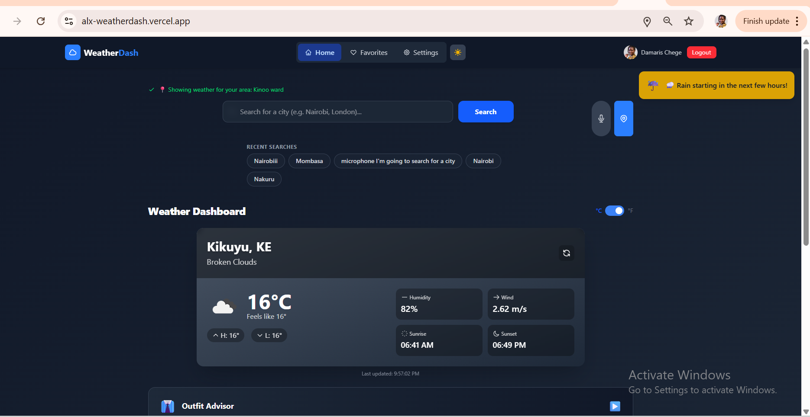

# 🌤️ Weather Dashboard - ALX Capstone Project

## 🏷️ Built With




## 📋 Table of Contents

- [Overview](#overview)
- [Features](#features)
- [Live Demo](#live-demo)
- [Tech Stack](#tech-stack)
- [Installation](#installation)
- [Configuration](#configuration)
- [Usage Guide](#usage-guide)
- [Feature Details](#feature-details)
- [API Integration](#api-integration)
- [Project Structure](#project-structure)
- [Challenges & Solutions](#challenges--solutions)
- [Future Enhancements](#future-enhancements)
- [Contributing](#contributing)
- [License](#license)
- [Acknowledgements](#acknowledgements)

## 🌟 Overview

Weather Dashboard is a responsive, feature-rich web application built as my ALX Frontend Capstone Project. It provides users with hyper-local, actionable weather information through an intuitive interface with smart features like voice search, city comparison, and AI-powered outfit recommendations.

The application solves the problem of generic weather forecasts by delivering personalized, context-aware weather data that helps users plan their day effectively—whether they're in a major city or a small town.

## 🔗 Live Demo

[https://alx-weatherdash.vercel.app/](https://alx-weatherdash.vercel.app/)

## ✨ Features

### 🎨 Core Features

| Feature | Description |
|---------|-------------|
| **Current Weather** | Real-time temperature, humidity, wind speed, and conditions |
| **5-Day Forecast** | Daily temperatures with rain probability bars |
| **Location Detection** | Auto-detects user location on page load |
| **City Search** | Search any city worldwide |

### 🚀 Advanced Features

| Feature | Description |
|---------|-------------|
| **🌗 Smart Theme** | Light/dark mode toggle with sunlight detection alert |
| **🔊 Voice Search** | Search cities using speech recognition |
| **📍 Auto-Location** | Instant local weather with reverse geocoding |
| **🔔 Smart Alerts** | Proactive notifications for rain, temperature shifts, and severe weather |
| **👕 Outfit Advisor** | AI-powered clothing suggestions based on weather conditions |
| **🆚 City Comparison** | Compare weather side-by-side for up to 4 cities |
| **⭐ Favorites** | Save favorite cities for quick access |
| **🕒 Recent Searches** | LocalStorage persistence for last 5 searches |
| **⚠️ Error Handling** | User-friendly error messages with retry options |
| **📱 Responsive Design** | Optimized for mobile, tablet, and desktop |

## 🛠️ Tech Stack

### Frontend

- **React 19** - UI library
- **Vite** - Build tool and development server
- **Tailwind CSS 4** - Styling with custom theming
- **React Router 7** - Navigation and routing

### State Management & Data Fetching

- **React Query (@tanstack/react-query)** - Server state management, caching
- **Axios** - HTTP client for API requests
- **LocalStorage** - Persist recent searches and preferences

### APIs

- **OpenWeatherMap API** - Current weather and 5-day forecast
- **OpenWeatherMap Geocoding API** - Reverse geocoding for location detection

### Utilities

- **React Hooks** - Custom hooks for reusable logic
- **SpeechRecognition API** - Voice search functionality
- **Geolocation API** - Browser-based location detection

### Testing & Quality

- **Vitest** - Unit testing
- **ESLint** - Code linting

## 💻 Installation

### Prerequisites

- Node.js (v18 or higher)
- npm or yarn
- OpenWeatherMap API key


1. **Clone the repository**

   ```bash
   git clone https://github.com/Dama5323/alx_project-capstone.git
   cd alx_project-capstone/weather-dashboard
### Step-by-Step Setup

2. **Install dependencies**


```bash
npm install
```

3. **Create environment variables file**

```bash
cp .env.example .env
```

4. **Add your API key to the .env file**

```env
VITE_WEATHER_API_KEY=your_api_key_here
```

5. ****Start the development server**

```bash
npm run dev
Open your browser and navigate to http://localhost:3000
```

## 🔧 Configuration

### 🔧 Environment Variables

| Variable | Description | Required |
|----------|-------------|----------|
| `VITE_WEATHER_API_KEY` | Your OpenWeatherMap API key | ✅ Yes |


### Tailwind Configuration
The project uses Tailwind CSS v4 with custom theming. Key configurations in index.css:

```css
@theme {
  --color-bg-light: #F8FAFC;
  --color-bg-dark: #0F172A;
  --color-card-light: #FFFFFF;
  --color-card-dark: #1E293B;
  --color-text-light: #0F172A;
  --color-text-dark: #F1F5F9;
}
``` 

## 📖 Usage Guide
Getting Started
1. Allow location access when prompted for auto-detection

2. Search for a city using the search bar or voice button

3. Toggle between °C and °F using the unit switch

4. Switch themes with the sun/moon toggle

## Feature Walkthrough
### 🌡️ Current Weather
- View temperature, "feels like", humidity, wind speed

- Check sunrise and sunset times

- See min/max temperatures for the day

### 📅 5-Day Forecast
- Scroll horizontally on mobile or view grid on desktop

- Each card shows: day, temperature, weather icon, description

- Rain probability bar visualizes chance of precipitation

### 🗣️ Voice Search
- Click the microphone button

- Speak a city name clearly

- App automatically searches and displays weather

### 👔 Outfit Advisor
- Expand the panel below the weather card

- Get personalized clothing recommendations

- Accessories like umbrella, sunglasses are suggested

### 🆚 City Comparison
- Click "Compare Cities" button

- Add up to 4 cities

- View side-by-side weather data

- Remove cities individually or clear all

### ⭐ Favorites
- Click the star icon to favorite a city

- Access favorites from the navigation menu

- Quickly switch between saved locations

## 🔧 Feature Details

### Smart Notifications System

The app monitors weather conditions and displays alerts for:

- 🌧️ Rain starting soon (next 3 hours)
- 🌡️ Extreme temperature shifts (>10°C change)
- ⚠️ Severe weather warnings (thunderstorms, etc.)

Notifications appear in the top-right corner and auto-dismiss after 8 seconds.

### Outfit Advisor Algorithm

The advisor considers:

- **Temperature** - Base clothing layer
- **Wind speed** - Windbreaker suggestions
- **Rain probability** - Umbrella, waterproof jacket
- **Humidity** - Breathable fabric recommendations

### Geolocation Flow

1. Browser requests location permission
2. Coordinates are captured on approval
3. Reverse geocoding gets city name
4. Weather fetched using coordinates (more accurate)
5. Fallback to Nairobi if location denied

### Voice Search Implementation

Uses the Web Speech API with:

- Punctuation cleaning (removes periods, commas)
- Loading state animation
- Error handling for unsupported browsers
- Fallback to manual search

## 🔌 API Integration

### OpenWeatherMap Endpoints

| Endpoint | Purpose | Parameters |
|----------|---------|------------|
| `weather` | Current weather | `q={city}` or `lat={lat}&lon={lon}` |
| `forecast` | 5-day forecast (3-hour intervals) | `q={city}` or `lat={lat}&lon={lon}` |
| `geo/1.0/reverse` | Reverse geocoding | `lat={lat}&lon={lon}` |

## 📁 Project Structure
weather-dashboard/
├── public/                 # Static assets
├── src/
│   ├── components/         # Reusable UI components
│   │   ├── ComparisonMode.jsx
│   │   ├── ErrorBoundary.jsx
│   │   ├── ErrorMessage.jsx
│   │   ├── ForecastChart.jsx
│   │   ├── Header.jsx
│   │   ├── NotificationCenter.jsx
│   │   ├── OutfitAdvisor.jsx
│   │   ├── ProtectedRoute.jsx
│   │   ├── RecentSearches.jsx
│   │   ├── SearchBar.jsx
│   │   ├── UnitToggle.jsx
│   │   ├── VoiceSearchButton.jsx
│   │   ├── WeatherCard.jsx
│   │   ├── WeatherDetails.jsx
│   │   └── auth/           # Authentication components
│   ├── context/            # React Context providers
│   │   ├── AuthContext.js
│   │   └── ThemeContext.js
│   ├── hooks/              # Custom React hooks
│   │   ├── useGeolocation.js
│   │   ├── useWeather.js
│   │   └── useWeatherNotifications.js
│   ├── pages/              # Page components
│   │   └── HomePage.jsx
│   ├── services/           # API services
│   │   ├── forecastService.js
│   │   └── weatherService.js
│   ├── utils/              # Utility functions
│   │   ├── locationUtils.js
│   │   └── outfitAdvisor.js
│   ├── App.js              # Main app component
│   ├── index.css           # Global styles (Tailwind)
│   └── main.jsx            # Entry point
├── .env.example             # Environment variables template
├── .gitignore               # Git ignore file
├── index.html               # HTML template
├── package.json             # Dependencies
├── postcss.config.js        # PostCSS config
├── tailwind.config.js       # Tailwind config
├── vite.config.js           # Vite config
└── README.md                # Project documentation


## 🧠 Challenges & Solutions

### Challenge 1: "City Not Found" for Small Towns

**Problem:** OpenWeatherMap API returned 404 errors for smaller towns and suburbs.

**Solution:**

- Switched from city name queries to coordinate-based requests
- Used browser geolocation to get precise coordinates
- Implemented reverse geocoding to get the actual location name
- Updated useWeather hook to accept lat/lon objects

### Challenge 2: Voice Search Adding Punctuation

**Problem:** Speech recognition added periods to city names (e.g., "Nairobi." causing 404).

**Solution:**

- Added text cleaning function to remove punctuation
- Used regex to strip `.,/#!$%^&*;:{}=-_~()`
- Trimmed whitespace and normalized spaces
- Added console logging for debugging

### Challenge 3: Duplicate Code Causing Errors

**Problem:** Multiple state declarations and conflicting geolocation logic.

**Solution:**

- Refactored into custom useGeolocation hook
- Removed duplicate state declarations
- Unified location handling with single state object
- Fixed useEffect dependencies

### Challenge 4: Error Objects Crashing App

**Problem:** Attempting to render Error objects directly in components.

**Solution:**

- Updated ErrorBoundary to extract message strings
- Modified error handling in hooks to return strings, not objects
- Added fallback UI with refresh and home options

### Challenge 5: API Rate Limiting

**Problem:** Too many API calls during development.

**Solution:**

- Implemented React Query with 5-minute staleTime
- Added caching for forecast data
- Reduced unnecessary refetches on unit toggle

## 🚀 Future Enhancements

### Short-term (Next Sprint)

- **User Authentication** - Login/signup with email
- **Cloud Sync** - Sync favorites across devices
- **Weather Maps** - Radar and satellite imagery
- **Hourly Forecast** - Detailed hour-by-hour breakdown

### Medium-term

- **Weather History** - Charts for past 7 days
- **Air Quality Index** - Health recommendations
- **Push Notifications** - Daily weather summaries
- **Multiple Units** - Add wind speed unit options (km/h, mph, m/s)

### Long-term

- **Weather Widget** - Embeddable widget for other sites
- **Mobile App** - React Native version
- **Weather Alerts by Email** - Customizable alerts
- **Internationalization** - Support for multiple languages

## 🤝 Contributing

Contributions are welcome! Here's how you can help:

1. Fork the repository
2. Create a feature branch

```bash
   git checkout -b feature/amazing-feature
```

3. Commit your changes

```bash
git commit -m 'feat: Add some amazing feature'
```

4. Push to the branch
```bash
git push origin feature/amazing-featur
```

5. Open a Pull Request
   
 ## Contribution Guidelines

- Follow the existing code style

- Add comments for complex logic

- Update documentation for new features

- Write tests when applicable

- Use conventional commit messages

## 🙏 Acknowledgements

- **ALX Africa** - For the comprehensive frontend program
- **OpenWeatherMap** - For providing the weather API
- **React Community** - For amazing tools and libraries
- **Tailwind CSS** - For the utility-first CSS framework
- **Vercel** - For free hosting and deployment
- **My Mentors & Peers** - For guidance and support

## 📞 Contact

**Damaris Chege**

- GitHub: [@Dama5323](https://github.com/Dama5323)
- Project Link: [https://github.com/Dama5323/alx_project-capstone](https://github.com/Dama5323/alx_project-capstone)
- Live Demo: [https://alx-weatherdash.vercel.app/](https://alx-weatherdash.vercel.app/)

## 🏆 Final Thoughts

This Weather Dashboard represents weeks of learning, problem-solving, and iteration. From the initial concept of a simple weather app to a full-featured dashboard with voice search, AI outfit recommendations, and city comparison—it's been an incredible journey.

The project demonstrates proficiency in:

✅ React hooks and custom hooks  
✅ API integration and error handling  
✅ Responsive design with Tailwind  
✅ Browser APIs (geolocation, speech recognition)  
✅ State management with React Query  
✅ User-centered design thinking  

I hope this project serves as both a useful tool and a demonstration of my frontend development skills. Thank you for checking it out!
